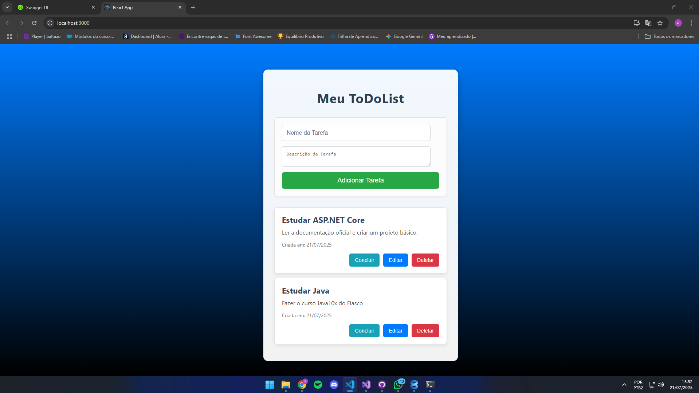

# ToDoList Simples

Este projeto é uma aplicação de lista de tarefas (ToDoList) simples, desenvolvida para testar meus conhecimentos e demonstrar a integração entre um **backend em ASP.NET Core Web API** e um **frontend em React**. Ele permite aos usuários criar, visualizar, editar, marcar como concluídas e excluir tarefas.

## Visão Geral do Projeto



-----

## Tecnologias Utilizadas

### Backend (API)

  * **ASP.NET Core Web API 8.0**: Framework para construção de APIs RESTful.
  * **Entity Framework Core**: ORM para acesso a dados e interação com o banco de dados.
  * **SQL Server**: Banco de dados relacional para persistência das tarefas.
  * **Swagger/OpenAPI**: Para documentação e teste da API.

### Frontend

  * **React (CRA - Create React App)**: Biblioteca JavaScript para construção da interface do usuário.
  * **HTML/CSS**: Para estruturação e estilização da aplicação.
  * **JavaScript (ES6+)**: Linguagem de programação principal do frontend.

-----

## Funcionalidades

  * **Listar Tarefas**: Visualize todas as tarefas existentes.
  * **Adicionar Tarefa**: Crie novas tarefas com nome e descrição.
  * **Editar Tarefa**: Altere o nome e a descrição de tarefas existentes.
  * **Marcar como Concluída**: Alterne o status de uma tarefa entre concluída e pendente.
  * **Excluir Tarefa**: Remova tarefas da lista.

-----

## Como Rodar o Projeto

Siga os passos abaixo para configurar e executar a aplicação em sua máquina.

### Pré-requisitos

  * [.NET SDK 8.0](https://dotnet.microsoft.com/download/dotnet/8.0) ou superior
  * [Node.js](https://nodejs.org/) (versão LTS recomendada)
  * [npm](https://www.npmjs.com/) (gerenciador de pacotes do Node.js) ou [Yarn](https://yarnpkg.com/)
  * [SQL Server](https://www.microsoft.com/pt-br/sql-server/sql-server-downloads) (ou SQL Server Express / LocalDB)

### 1\. Configuração do Backend (API)

1.  **Clone o repositório:**

    ```bash
    git clone [URL_DO_SEU_REPOSITORIO]
    cd ToDoListBackend
    ```

    (Assumindo que sua API está em uma pasta chamada `ToDoListBackend` ou similar. Ajuste o nome da pasta se for diferente.)

2.  **Configurar o Banco de Dados:**

      * Abra o arquivo `appsettings.json` (ou `appsettings.Development.json`) na pasta do projeto da API.
      * Atualize a string de conexão `"DefaultConnection"` para apontar para sua instância local do SQL Server. Exemplo:
        ```json
        "ConnectionStrings": {
          "DefaultConnection": "Server=(localdb)\\mssqllocaldb;Database=ToDoListDb;Trusted_Connection=True;MultipleActiveResultSets=true"
        }
        ```
      * **Executar Migrações:** Navegue até a pasta raiz do seu projeto da API no terminal e execute os comandos do Entity Framework Core para criar o banco de dados e as tabelas:
        ```bash
        dotnet ef database update
        ```

3.  **Rodar a API:**

    ```bash
    dotnet run
    ```

    A API será iniciada, geralmente em `https://localhost:7025` (verifique o console para a URL exata).

4.  **Configurar CORS (muito importante para o frontend):**
    Certifique-se de que a política CORS em seu arquivo `Program.cs` (ou `Startup.cs`) permite requisições do seu frontend React. A porta padrão do React é `3000`.

    ```csharp
    // Em Program.cs
    builder.Services.AddCors(options =>
    {
        options.AddPolicy("AllowSpecificOrigin",
            builder => builder.WithOrigins("http://localhost:3000") // A porta padrão do React
                             .AllowAnyHeader()
                             .AllowAnyMethod());
    });
    // ...
    app.UseCors("AllowSpecificOrigin"); // Certifique-se de que esta linha esteja ANTES de app.UseAuthorization() e app.MapControllers();
    ```

### 2\. Configuração do Frontend (React)

1.  **Navegue para a pasta do frontend:**

    ```bash
    cd ../todolist-frontend
    ```

    (Ajuste o nome da pasta se for diferente.)

2.  **Instale as dependências:**

    ```bash
    npm install
    # ou
    yarn install
    ```

3.  **Verifique a URL da API:**
    No arquivo `src/App.js` do frontend, certifique-se de que a constante `API_URL` aponta para o endereço correto da sua API (ex: `https://localhost:7025/Tarefas`).

4.  **Rodar o Frontend:**

    ```bash
    npm start
    # ou
    yarn start
    ```

    O aplicativo React será aberto automaticamente no seu navegador, geralmente em `http://localhost:3000`.

-----

## Contribuição

Sinta-se à vontade para clonar o projeto, explorar o código e fazer melhorias\!

-----
